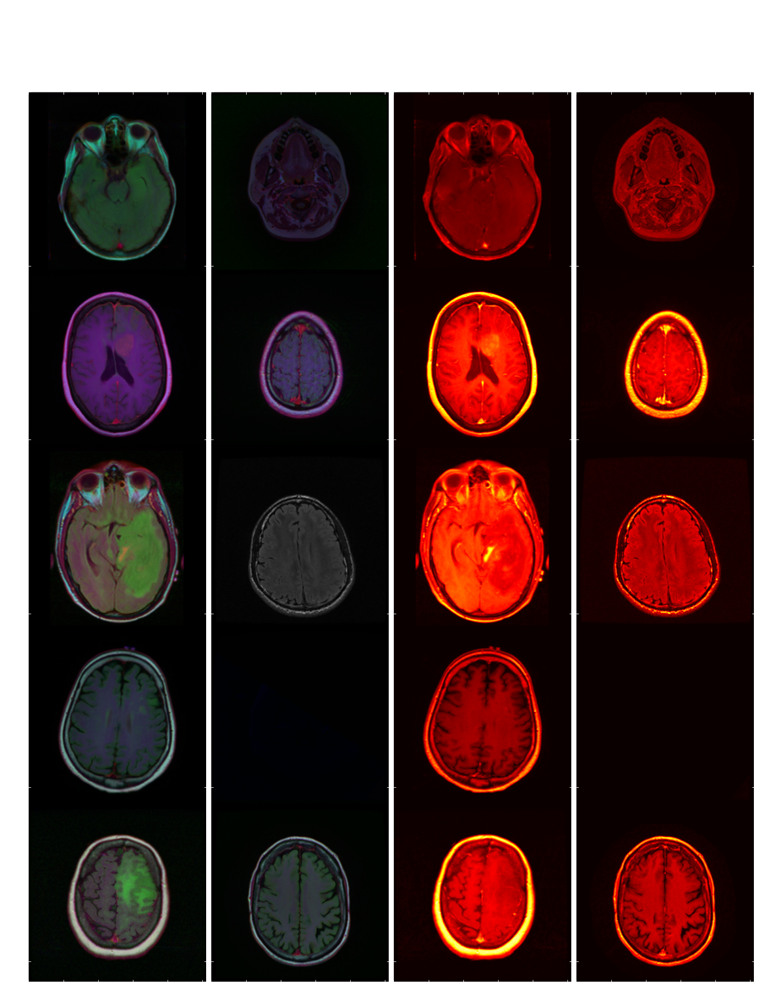
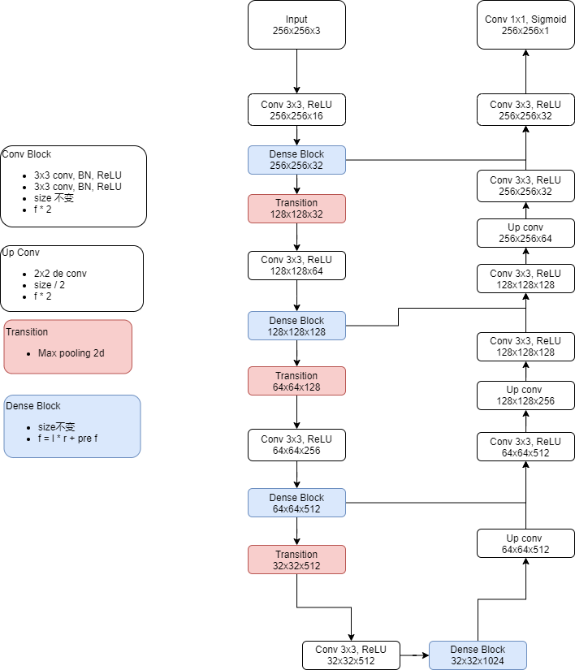

# Dense-U-Net-PyTorch

This repository contains simple PyTorch implementations of U-Net with Dense Encoder structure.

## Overview

This repository contains an Pytorch implementation of U-Net structure.
And combine the DenseNet into the Encoder part.
With full coments and my code style.

There have two toy structure of U-Net and FCN implementaion.

- [U-Net](toy/unet_pytorch.ipynb)
- [FCN](toy/FCN_pytorch.ipynb)

## About U-Net

<!-- If you're new to U-Net structure, here's an abstract straight from the paper[1]:

There is large consent that successful training of deep networks requires many thousand annotated training samples. In this paper, we present a network and training strategy that relies on the strong use of data augmentation to use the available annotated samples more efficiently. The  architecture consists of a contracting path to capture context and a symmetric expanding path that enables precise localization. We show that such a network can be trained end-to-end from very
few images and outperforms the prior best method (a sliding-window convolutional network) on the ISBI challenge for segmentation of neuronal structures in electron microscopic stacks. Using the same network trained on transmitted light microscopy images (phase contrast and DIC) we won the ISBI cell tracking challenge 2015 in these categories by a large margin. Moreover, the network is fast. Segmentation of a 512x512 image takes less than a second on a recent GPU. -->

## Dataset

Dataset used for development and evaluation was made publicly available on Kaggle: [kaggle.com/mateuszbuda/lgg-mri-segmentation](https://www.kaggle.com/mateuszbuda/lgg-mri-segmentation).
It contains MR images from [TCIA LGG collection](https://wiki.cancerimagingarchive.net/display/Public/TCGA-LGG) with segmentation masks approved by a board-certified radiologist at Duke University.



## Model

A segmentation model implemented in this repository is U-Net with dense encoder with added batch normalization.



## Dense Structure

The Dense Block output feature is:

`output feature = pre feature + num layer * growth rate`

For the lgg brain dataset, we set the num layer and growth rate like:

| dataset                | num layer | growth rate |
| ---------------------- | --------- | ----------- |
| dense block 1          | 4         | 4           |
| dense block 2          | 8         | 8           |
| dense block 3          | 16        | 16          |
| dense block bottleneck | 16        | 32          |


- [ ] todo look for the another number

## Implement

``` python

```

## Usage

- dense unet model  
`python3 main.py --version [version] --batch_size [] --model dense_unet >logs/[log_path]`
- unet model   
`python3 main.py --version [version] --batch_size [] --model unet >logs/[log_path]`


## Directory Structure

``` bash
.
|-- README.md
|-- dataset
|   |-- __init__.py
|   |-- brain_dataset.ipynb
|   |-- dataset.png
|   `-- dataset.py
|-- list.txt
|-- main.py
|-- models
|   |-- U_Net.py
|   `-- __init__.py
|-- requirements.txt
|-- toy
|   |-- FCN_pytorch.ipynb
|   |-- helper.py
|   |-- simulation.py
|   `-- unet_pytorch.ipynb
|-- trainer.py
`-- utils
    |-- __init__.py
    `-- utils.py
```

## Reference

1. [U-Net](https://arxiv.org/abs/1505.04597)
2. [FCN](https://arxiv.org/abs/1411.4038)
3. [U-Net for brain segmentation](https://github.com/mateuszbuda/brain-segmentation-pytorch)
